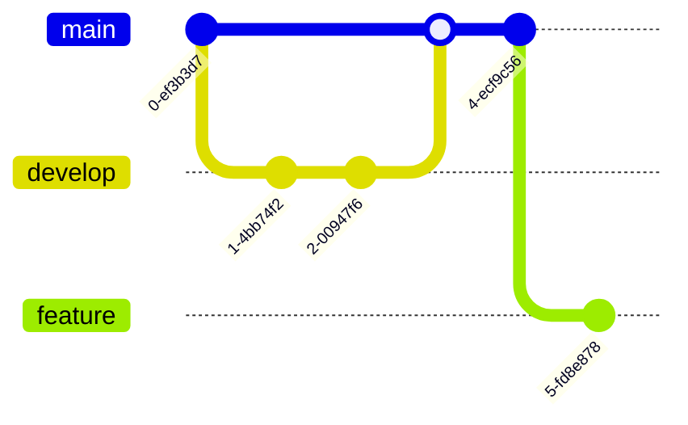

# mermaid
Mermaid Markdown

# Mermaid UML Syntax Guide

## Basic Flowchart
Simple flowchart with basic shapes and connections:

## Flowchart with Text Styles
Demonstrates text formatting and line styles:

## Sequence Diagram
Shows interaction between components:

## Class Diagram
Represents system structure:

## State Diagram
Illustrates state transitions:

## Entity Relationship Diagram
Database structure representation:

## Gantt Chart
Project timeline visualization:

## Git Graph
Git branch visualization:

## Pie Chart
Data distribution:

## Complex Flowchart
Advanced example combining multiple features:

